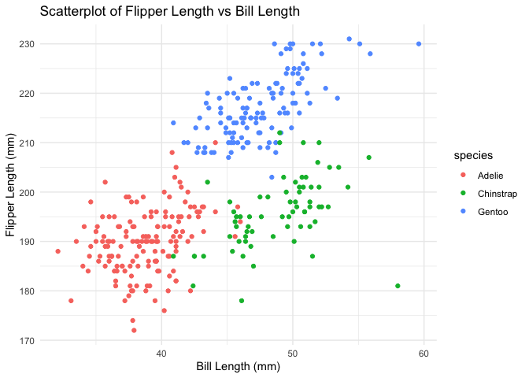

p8105_hw1_ly2633
================
Leila Yan
2024-09-13

``` r
# load the libraries
library(tidyverse)
```

    ## ── Attaching core tidyverse packages ──────────────────────── tidyverse 2.0.0 ──
    ## ✔ dplyr     1.1.4     ✔ readr     2.1.5
    ## ✔ forcats   1.0.0     ✔ stringr   1.5.1
    ## ✔ ggplot2   3.5.1     ✔ tibble    3.2.1
    ## ✔ lubridate 1.9.3     ✔ tidyr     1.3.1
    ## ✔ purrr     1.0.2     
    ## ── Conflicts ────────────────────────────────────────── tidyverse_conflicts() ──
    ## ✖ dplyr::filter() masks stats::filter()
    ## ✖ dplyr::lag()    masks stats::lag()
    ## ℹ Use the conflicted package (<http://conflicted.r-lib.org/>) to force all conflicts to become errors

## Problem 1

``` r
# Load the dataset
data("penguins", package = "palmerpenguins")

# Calculate the mean flipper length
mean_flipper_length <- mean(penguins$flipper_length_mm, na.rm = TRUE)
```

Write a short description of the penguins dataset (not the penguins_raw
dataset) using inline R code. In your discussion, please include: the
data in this dataset, including names / values of important variables
the size of the dataset (using nrow and ncol) the mean flipper length

-200.915

``` r
# Create a scatterplot
# load the library
ggplot(penguins, aes(x = bill_length_mm, y = flipper_length_mm, color = species)) +
  geom_point() +
  labs(
    title = "Scatterplot of Flipper Length vs Bill Length",
    x = "Bill Length (mm)",
    y = "Flipper Length (mm)"
  ) +
  theme_minimal()
```

    ## Warning: Removed 2 rows containing missing values or values outside the scale range
    ## (`geom_point()`).

<!-- -->

Make a scatterplot of flipper_length_mm (y) vs bill_length_mm (x); color
points using the species variable (adding color = … inside of aes in
your ggplot code should help).

Export your first scatterplot to your project directory using ggsave.

## Problem 2

This problem is intended to emphasize variable types and introduce
coercion; some awareness of how R treats numeric, character, and factor
variables is necessary for working with these data types in practice.

Create a data frame comprised of:

a random sample of size 10 from a standard Normal distribution a logical
vector indicating whether elements of the sample are greater than 0 a
character vector of length 10 a factor vector of length 10, with 3
different factor “levels” Try to take the mean of each variable in your
dataframe. What works and what doesn’t?

Hint: to take the mean of a variable in a dataframe, you need to pull
the variable out of the dataframe. Try loading the tidyverse and using
the pull function.

In some cases, you can explicitly convert variables from one type to
another. Write a code chunk that applies the as.numeric function to the
logical, character, and factor variables (please show this chunk but not
the output). What happens, and why? Does this help explain what happens
when you try to take the mean?

<!-- -->

Note that the `echo = FALSE` parameter was added to the code chunk to
prevent printing of the R code that generated the plot.
